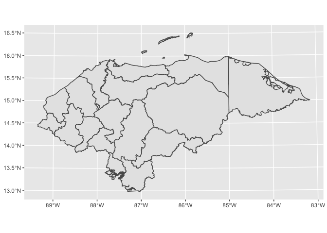
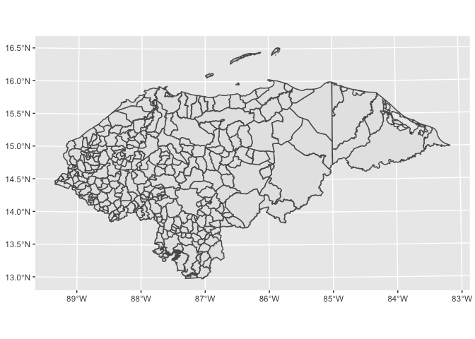

<!-- README.md is generated from README.Rmd. Please edit that file -->

# *openhn*

<!-- badges: start -->
<!-- badges: end -->

El objetivo del paquete `openhn` es facilitar el uso de R a estudiantes,
investigadores, analistas y cualquier persona interesada proporcionado
datos socioeconómicos de Honduras a nivel departamental y municipal.

El paquete `openhn` contiene:

-   `produccion`: Datos proporcionados por el Banco Central de Honduras
    (BCH) que incluye la producción (millones de lempiras) de las
    actividades económicas trimestral en valores constantes. Los datos
    estan en formato
    [Tidy](https://cran.r-project.org/web/packages/tidyr/vignettes/tidy-data.html).
    (Fuente: [BCH](https://www.bch.hn/))

-   `departamento`: Datos proporcioandos por el Instituto Nacional de
    Estadística Honduras (INE) y el Sistema Estadistico Policial en
    Linea (SEPOL) que incluye la población, homicidios y tasa de
    homicidios por 100,000 habitantes en los 18 departamentos de
    Honduras en 2019. (Fuente: [INE](https://www.ine.gob.hn/V3/),
    [SEPOL](https://www.sepol.hn/))

-   `map_departamental`: Datos proporcionados por la Iniciativa de Datos
    Abiertos del Gobierno de Honduras que proporciona información de los
    limites administrativos de los departamento de Honduras. (Fuente:
    [https://datos.gob.hn/](Gobierno%20de%20Honduras))

-   `map_municipal`: Datos proporcionados por la Iniciativa de Datos
    Abiertos del Gobierno de Honduras que proporciona información de los
    limites administrativos municipales de Honduras. (Fuente:
    [https://datos.gob.hn/](Gobierno%20de%20Honduras))

### Instalación

Puede instalar la versión de desarrollo desde
[GitHub](https://github.com/) con:

``` r
# install.packages("devtools")
devtools::install_github("Nolivera007/openhn")
```

### Información sobre el paquete.

``` r
library(openhn)

?openhn
?produccion
?departamento
```

### produccion

Ver la producción anual de cada actividad económica.

``` r
library(tidyverse)

data(produccion)

produccion %>%
  group_by(año, actividad_economica) %>%
  summarise(produccion_anual = sum(hnl))
#> # A tibble: 315 x 3
#> # Groups:   año [21]
#>      año actividad_economica                                    produccion_anual
#>    <int> <chr>                                                             <dbl>
#>  1  2000 Administración Pública y Defensa; Planes de Seguridad…            5921.
#>  2  2000 Agricultura, Ganadería, Caza, Silvicultura y Pesca               15329.
#>  3  2000 Comercio, Reparación de Vehículos Automotores, Motoci…           15710.
#>  4  2000 Comunicaciones                                                    4090.
#>  5  2000 Construcción                                                      6244.
#>  6  2000 Electricidad y Distribución de Agua                               2701 
#>  7  2000 Explotación de Minas y Canteras                                    489.
#>  8  2000 Impuestos netos de subvenciones sobre la producción y…           10118.
#>  9  2000 Industrias Manufactureras                                        21902.
#> 10  2000 Intermediación Financiera                                         5084.
#> # … with 305 more rows
```

### departamento

Cálcular la media, la media recortada y la mediana de la población.

``` r
data(departamento)

departamento %>%
  summarise(
    media = mean(poblacion),
    media_recortada = mean(poblacion, trim = 0.1),
    mediana = median(poblacion)
)
#> # A tibble: 1 x 3
#>     media media_recortada mediana
#>     <dbl>           <dbl>   <dbl>
#> 1 508797.         458327. 434870.
```

### map\_departamental

``` r
# install.packages("sf", dependencies = TRUE)
data(map_departamental)

map_departamental %>% 
  ggplot() +
  geom_sf()
```



### map\_municipal

``` r
data(map_municipal)

map_municipal %>% 
  ggplot() +
  geom_sf()
```


